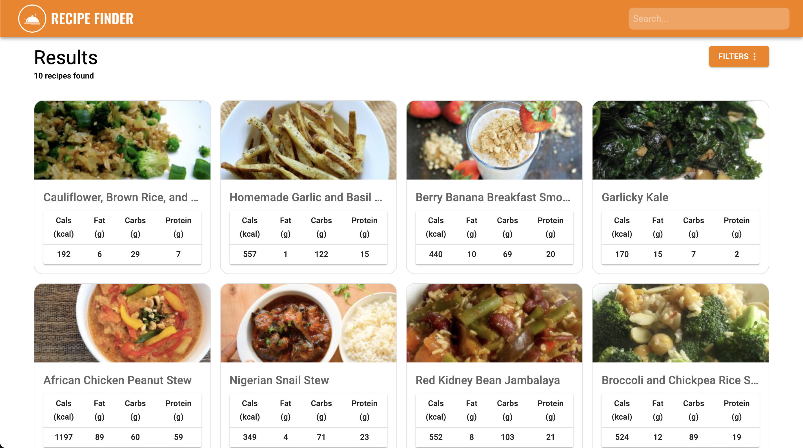
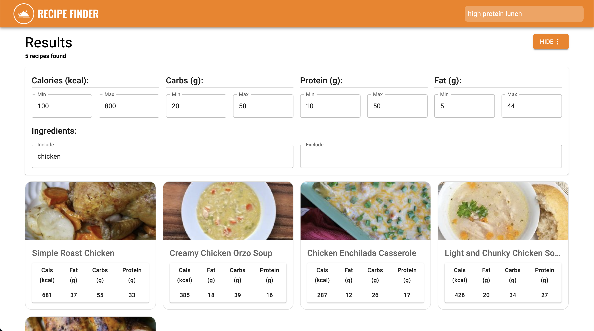
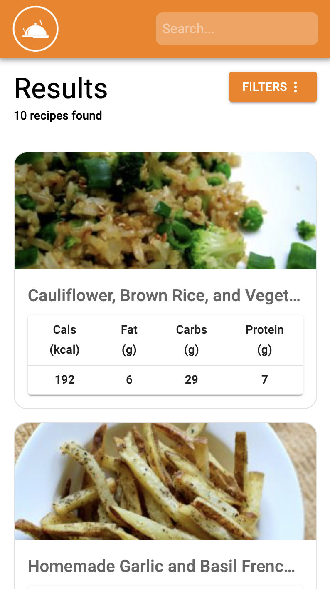

    

[Recipe Finder](https://recipefinder.up.railway.app) is a web app for fetching recipes quickly and easily!

## 🔎 Refined Searches

## 📱 Mobile Friendly

# 🧑‍💻 Tech Stack, APIs, Tools

- [ReactJS](https://reactjs.org/)
- [ExpressJS](https://expressjs.com/)
- [Spoonacular API](https://spoonacular.com/food-api)
- [Railway.app](https://railway.app/)
